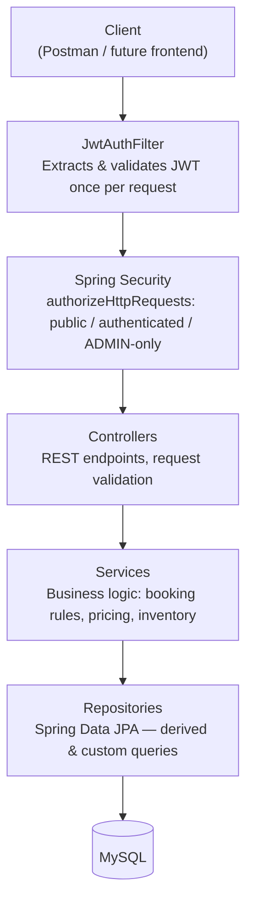
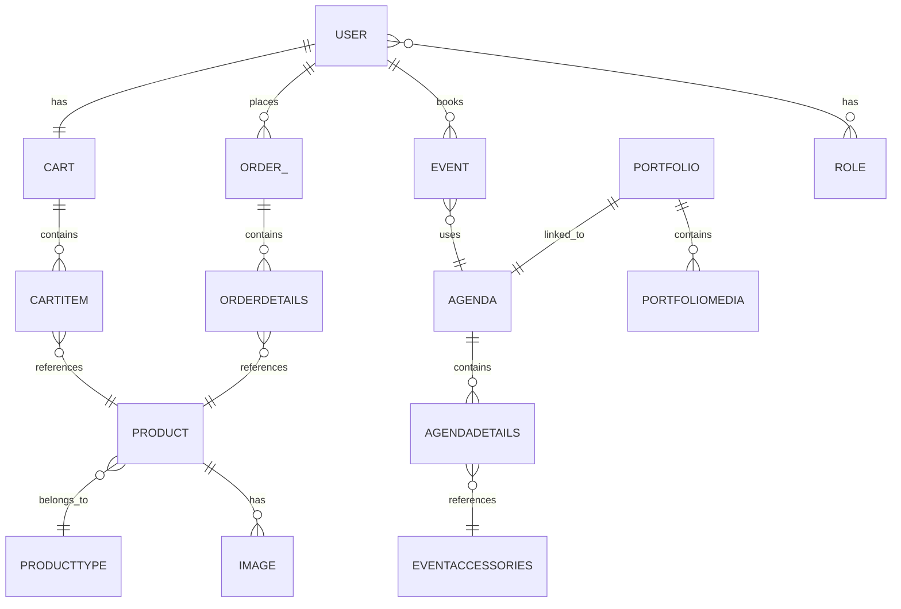
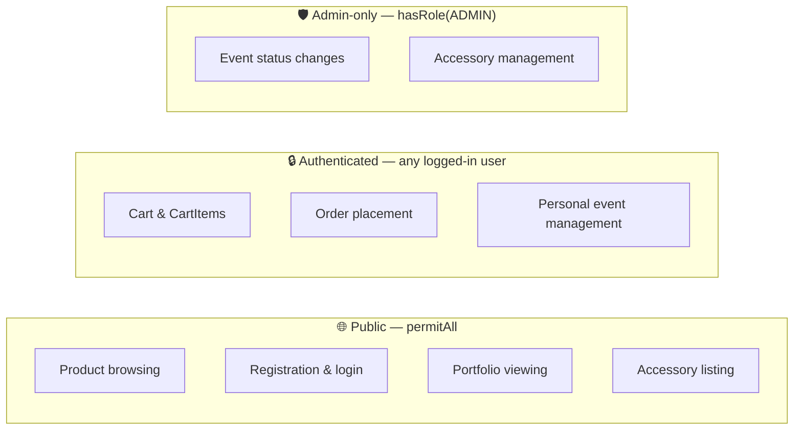

# 📸 STUPHY — The Studio Photography

**Event Booking, E-Commerce & Portfolio Platform — Backend REST API**

A unified Spring Boot backend built for a real photography/event studio client, helping the business transition from offline operations to a full digital platform — covering **event booking**, **product e-commerce**, and **portfolio showcase** — all in one system.


---

## 📌 Overview

Traditional photography studios run on manual, offline processes — phone calls to check date availability, paper booking records, cash sales for accessories, and scattered social media posts as a "portfolio." STUPHY digitizes all of it into a single RESTful platform:

- **Booking collisions** are prevented through status-driven event scheduling.
- **Self-service** lets clients book, track, and manage their own events and orders.
- **Unified commerce** connects accessory/product sales with event bookings under one account.
- **A searchable portfolio** showcases past work, filterable by event.

**Base URL:** `http://localhost:8080/api/v1`

---

## ✨ Key Features

### 👤 User Management
- Registration, login, and account deletion
- Email OTP verification with **BCrypt-hashed OTP storage** (no plaintext OTPs in DB)
- Forgot-password recovery flow
- Profile retrieval and updates
- Role-based access control (`ADMIN`, `USER`)

### 📅 Event & Agenda Management
- Book, update, and cancel events
- Status-driven lifecycle: `NOT_BOOKED` → `BOOKED` → `COMPLETED` / `CANCELLED`
- Retrieve events by date, status, or user — with separate admin and user views
- Agenda system linking bookings to accessories with dynamic price calculation
  (`Event → Agenda → AgendaDetails → EventAccessories`)

### 🛍️ Product & Catalog
- Full CRUD for products and product types/categories
- Search by name/type, product count by category
- Image upload, retrieval, update, and deletion per product

### 🛒 Cart & Orders
- Add/remove cart items, clear cart, retrieve cart contents
- Place orders by cart or direct product purchase
- Order address management (embedded address, not a separate table)
- Order status lifecycle tracking and admin status updates

### 🖼️ Portfolio Showcase
- Upload and manage portfolio media (images, videos, presentation files)
- **Hybrid storage model:** media files on local file system, metadata (filename, size, type, download URL) in MySQL
- Filter portfolios by associated event agenda
- Download portfolio files directly via API

### 🔐 Security
- JWT-based stateless authentication
- Spring Security role-based authorization (`ADMIN` / `USER`) enforced at both URL and method level (`@PreAuthorize`)
- BCrypt password and OTP hashing
- Automated email notifications for account and booking events

---

## 🛠️ Tech Stack

| Layer | Technology |
|---|---|
| Language | Java 21 |
| Framework | Spring Boot |
| Security | Spring Security, JWT |
| Data Access | Spring Data JPA, Hibernate |
| Database | MySQL |
| API Docs | Swagger / OpenAPI |
| Build Tool | Maven |
| API Testing | Postman |
| Version Control | Git & GitHub |

---

## 🏗️ Architecture

STUPHY follows a clean **layered architecture** (Controller → Service → Repository → MySQL), applied consistently across all 10 modules.

### Request Lifecycle



### Core Entity Relationships



### Security Boundaries



> **Note:** GitHub renders these diagrams automatically since they're written in [Mermaid](https://mermaid.js.org/) — no image files needed. If you're viewing this in an editor that doesn't support Mermaid, view it directly on GitHub.com.

---

## 📁 Project Structure

```text
src
├── controller
├── service
│   └── impl
├── repository
├── model
├── enums
├── dto
│   ├── request
│   └── response
├── security
│   ├── config
│   └── jwt
├── exception
├── config
└── StuphyApplication.java
```

---

## 🎯 Notable Design Decisions

- **Hybrid storage model** — portfolio media (images/videos/PPTs) lives on the local file system, not in MySQL as BLOBs. Only metadata is stored relationally, keeping the database lean.
- **JSON-typed pricing column** — `EventAccessories` uses Hibernate's `@JdbcTypeCode(SqlTypes.JSON)` to map a `HashMap<EventName, BigDecimal>`, allowing per-event-type pricing without schema migrations for new event types.
- **Stateless JWT auth** — no server-side sessions; every request carries a signed token validated once per request by a custom `OncePerRequestFilter`.
- **Three-tier security boundaries** — public / authenticated / admin-only, enforced at both the URL-pattern level (`SecurityFilterChain`) and the method level (`@PreAuthorize`).
- **Cascading & orphan removal** — parent-child entities (`Agenda→AgendaDetails`, `Cart→CartItem`, `Portfolio→PortfolioMedia`) use `CascadeType.ALL` with `orphanRemoval=true` for clean deletes with no orphaned rows.

---

## 🚀 Getting Started

### Prerequisites
- Java 21+
- Maven 3.8+
- MySQL 8+

### Setup

```bash
# Clone the repository
git clone https://github.com/NatarajanRaja2005/stuphy-backend.git
cd stuphy-backend

# Configure your database credentials in
# src/main/resources/application.properties

# Build and run
mvn clean install
mvn spring-boot:run
```

The API will be available at `http://localhost:8080/api/v1`, with Swagger docs at `http://localhost:8080/swagger-ui/index.html`.

### Environment Variables

```properties
spring.datasource.url=jdbc:mysql://localhost:3306/stuphy
spring.datasource.username=YOUR_DB_USERNAME
spring.datasource.password=YOUR_DB_PASSWORD

jwt.secret=YOUR_JWT_SECRET

spring.mail.username=YOUR_EMAIL
spring.mail.password=YOUR_EMAIL_APP_PASSWORD

admin.seed.email=YOUR_SEED_ADMIN_EMAIL
admin.seed.password=YOUR_SEED_ADMIN_PASSWORD
```

> ⚠️ Never commit real credentials or a real JWT secret to this file — use environment variables locally (a gitignored `.env`) as shown above.

---

## 📮 API Testing

A complete Postman collection covering all modules (User, Product, Cart, Orders, Event, Agenda, Portfolio) is included for testing. JWT tokens are stored via the `json_web_token` collection variable and auto-applied to authenticated requests.

Interactive Swagger UI is also available after startup:

```
http://localhost:8080/swagger-ui/index.html
```

---

## 🗺️ Roadmap

- [x] JWT authentication & role-based authorization
- [x] Email OTP verification (BCrypt-hashed)
- [x] Forgot password recovery flow
- [ ] Phone/SMS OTP verification
- [ ] AWS deployment (EC2 + RDS)
- [ ] Rate limiting on OTP endpoints

---

## 👤 Author

**Natarajan R**
Java Backend Developer | [LinkedIn](https://linkedin.com/in/natarajanraja2005) | [Portfolio](https://natarajanraja2005.github.io/Natarajanportfolio/) | [LeetCode](https://leetcode.com/u/NatarajanRaja2005)

---

## 📄 License

This project is built for a real client engagement. Code structure and architecture are shared here for portfolio purposes.

---

⭐ If you found this project useful, consider giving it a Star on GitHub.
